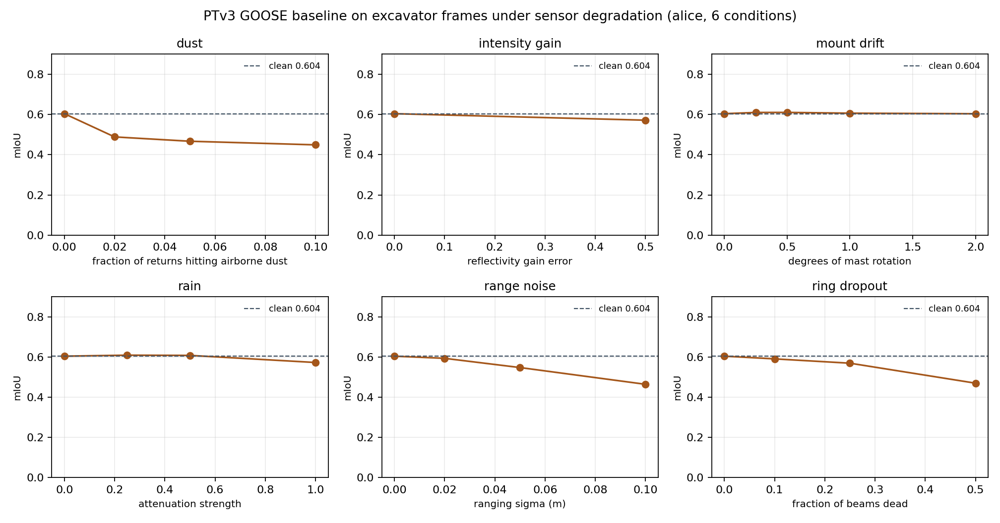

# Off-road lidar perception under degraded sensing

How well does a published off-road 3D segmentation baseline hold up when the sensor
stops being clean? This repository audits the
[GOOSE 3D challenge](https://www.codabench.org/competitions/5745) baseline on data
recorded from a **Liebherr R924 tracked excavator**, and measures what happens as the
lidar is degraded the way a machine in the field degrades it: a sensor mast that shifts,
beams that die, dust, rain.

Everything here is measured on rented hardware, not estimated.

---

## Why this dataset

[GOOSE-Ex](https://arxiv.org/abs/2409.18788) is, as far as I can find, the only public
semantic segmentation dataset recorded from a working excavator. It ships 5,000 labelled
multimodal frames from a Liebherr R924 (`alice`) and a Boston Dynamics Spot (`spot`), in
landfill, quarry and construction environments, and combines with the original
[GOOSE](https://arxiv.org/abs/2310.16788) offroad-vehicle data into a single challenge
taxonomy of 9 superclasses.

What the validation split actually contains (`tools/inspect_goose.py`):

| | frames | points | points / frame |
|---|---|---|---|
| `alice` — Liebherr R924 excavator | 192 | 51.5 M | 268,173 |
| `spot` — quadruped | 215 | 18.0 M | 83,642 |
| `vehicle` — GOOSE offroad vehicle | 961 | 174.9 M | 181,989 |

The excavator returns **3.2x more points per frame than the quadruped**, from a mast
looking down at its own work area. Any claim that a model "generalizes across platforms"
has to survive that gap, which is why the platform slice is reported separately
everywhere below.

The class mix on the excavator frames is pure earthworks — soil 33%, low grass 20%,
asphalt 6%, debris 4.6% — and **19.4% of all returns are the machine itself**
(`ego_vehicle`): the arm and bucket swinging through the field of view, which is the
self-occlusion case an excavator has and a car does not.

## What is measured

1. **Reproduce the published baseline.** The official PTv3 checkpoint reports
   `mIoU/mAcc/allAcc 0.8096/0.8576/0.9197` on the challenge validation split. Step one
   is getting that number back on a pristine checkout, before touching anything.
2. **Slice it by platform.** One prediction pass, three numbers: excavator, quadruped,
   offroad vehicle. The headline number is dominated by the vehicle frames, which are
   72% of the validation points.
3. **Degrade the sensor and watch it fall.** Seeded, reproducible perturbations applied
   to the excavator frames only, scored with the same model and the same metric:

   | condition | what it models |
   |---|---|
   | `mount_drift` | the sensor mast shifting a fraction of a degree — a retrofit kit on a machine that vibrates all day |
   | `ring_dropout` | dead or blinded beams |
   | `dust` | particulate returns: beams terminating early, weakly, on airborne dust |
   | `rain` | range-dependent attenuation — far returns lost first, survivors dimmer |
   | `range_noise` | ranging jitter along the beam |
   | `intensity_gain` | reflectivity calibration drift |

   Mount drift is the one that matters most for an aftermarket autonomy kit, and it is
   the closest thing this data supports to the extrinsic-calibration drift a
   camera+lidar stack would suffer: the archives ship no camera extrinsics, so true
   early-fusion calibration studies are not possible on this release.

## The result so far

The published PTv3 checkpoint scores **0.7830 mIoU** over all 1,368 validation
frames here (single forward pass; the published 0.8096 uses 10-way test-time
augmentation — see the caveat below). Sliced by the platform the frames came from,
the same predictions read:

| platform | mIoU | mAcc | allAcc | points |
|---|---|---|---|---|
| `vehicle` — offroad vehicle | **0.7968** | 0.8632 | 0.9281 | 174.9 M |
| `spot` — quadruped | 0.7113 | 0.8091 | 0.8003 | 18.0 M |
| `alice` — **Liebherr R924 excavator** | **0.6040** | 0.6812 | 0.9010 | 51.5 M |

**The headline number is the vehicle talking.** It contributes 72% of the validation
points, and the excavator sits 19 mIoU points below it — on a checkpoint whose own
config trains on `["train", "trainEx"]`, so excavator frames were *in the training
set*. This is not a zero-shot transfer gap.

Two classes account for almost all of it:

| class | excavator IoU | excavator points | vehicle IoU |
|---|---|---|---|
| `obstacle` | **0.060** | 3,145,603 (6.1%) | 0.660 |
| `artificial_ground` | **0.013** | 783,447 (1.5%) | 0.737 |
| `natural_ground` | 0.882 | 31,077,410 (60.4%) | 0.797 |

Neither is starved of support — three million labelled obstacle points is not a
small-sample artifact. The confusion matrix says exactly what happens instead:

| from the excavator | predicted as |
|---|---|
| `obstacle` | **natural_ground 89%**, obstacle 7%, vegetation 2% |
| `artificial_ground` | **natural_ground 98%**, artificial_ground 1% |

From the same viewpoint the vehicle keeps 79% of its obstacle points and 81% of its
artificial ground. **Seen from an excavator's mast, the model flattens obstacles and
made ground into dirt** — it holds on to the dominant class (soil, 60% of returns, IoU
0.88) and loses the two classes a machine that digs has the most reason to care about.

Caveat on the anchor: this run uses a single forward pass, not the baseline's 10-way
TTA, so 0.7830 is not a like-for-like reproduction of 0.8096. The platform *gap* is
measured within one protocol and does not depend on that difference, but quantifying
the TTA delta is the next thing on the list.

## What breaks it, and what does not

Seventeen conditions, applied to the 192 excavator frames only, scored with the same
checkpoint and the same single-pass protocol. Clean excavator baseline is 0.6040.



| condition | level | mIoU | delta |
|---|---|---|---|
| **dust** | 2% of returns | **0.4884** | **−0.116** |
| | 5% | 0.4669 | −0.137 |
| | 10% | 0.4489 | −0.155 |
| **range noise** | σ = 2 cm | 0.5932 | −0.011 |
| | σ = 5 cm | 0.5473 | −0.057 |
| | σ = 10 cm | 0.4640 | −0.140 |
| **dead beams** | 10% | 0.5905 | −0.014 |
| | 25% | 0.5690 | −0.035 |
| | 50% | 0.4696 | −0.134 |
| rain | strong (28% of returns lost) | 0.5724 | −0.032 |
| reflectivity gain error | +50% | 0.5716 | −0.032 |
| **mount drift** | 0.25° – 2.0° | 0.610 – 0.604 | **≈ 0** |

Three things worth taking away:

1. **Dust is the expensive one, and it is cheap to cause.** Corrupting **2%** of returns
   costs 0.116 mIoU — about the same as killing **half the sensor's beams** (0.134). The
   curve has its knee immediately: going from 2% to 10% dust costs only another 0.04. For
   a machine whose work throws dust continuously, the first sliver matters most.

2. **Mount drift does nothing.** Rotating the whole cloud by up to 2°, the way a sensor
   mast shifts on a machine that vibrates all day, leaves the score flat — and slightly
   *above* baseline at small angles, which is noise. The failure mode I built this sweep
   to catch is not a failure mode. That is worth knowing before anyone spends engineering
   effort on mount rigidity for this kind of model.

3. **Graceful where you would want it to be brittle, brittle where you would want grace.**
   Losing a quarter of the beams costs 0.035. Ranging jitter of 10 cm costs 0.140. The
   model leans on geometry precision far more than on point count.

Every condition is seeded per file, so `tools/degrade.py` reproduces the exact clouds
scored here. Raw numbers: [`results/sweep/`](results/sweep/) and
[`results/figures/degradation.csv`](results/figures/degradation.csv).

## A model that fits on the machine

The audit above says the published baseline cannot see obstacles from an excavator.
The obvious follow-up is whether something small enough to run *on* the machine does
better. PTv3 cannot: it needs `pointops`, `spconv` and flash-attention, none of which
exist for a Maxwell-era Jetson.

**Representation, chosen by measurement.** The obvious deployable choice is a range
image, and it fails on this data. GOOSE-Ex's excavator frames are *accumulated* clouds,
not single sweeps - one 0.1 deg x 0.1 deg direction holds ~20 returns spanning metres of
range (one held 235 points from 2.7 to 9.5 m). A spherical projection keeps 4.2% of
points at 64x1024 and still only 33.6% at 256x4096. A 0.20 m BEV grid over +/-40 m keeps
**100%**, and a per-cell majority label round-trips **94.1%** of per-point labels -
including **95.96% of obstacle points**, checked per class rather than in aggregate.

**The model** is a 1.93M-parameter U-Net over a 5x400x400 BEV tensor (occupancy, max z,
min z, mean intensity, log density), using only Conv, BatchNorm, ReLU, MaxPool,
ConvTranspose and Concat - every one native to TensorRT 8.2 at ONNX opset 11, so it
exports without a single plugin. Trained on 2,164 excavator frames with inverse-sqrt
class weighting, because an unweighted loss on data that is 66% natural ground simply
predicts dirt.

### Accuracy, scored the same way as the baseline

Predictions are scattered back to every point in the original cloud and written as
`.label` files, then scored by the same `tools/eval_miou.py` with the same ground truth
and the same platform slicing used on PTv3. The two numbers belong in one table:

| | BEV U-Net (1.93M) | PTv3 (published) |
|---|---|---|
| **mIoU, excavator frames** | **0.6399** | 0.6040 |
| allAcc | 0.8741 | 0.9010 |

| class | BEV | PTv3 |
|---|---|---|
| `other` | 0.877 | 0.933 |
| `artificial_structures` | 0.794 | 0.775 |
| `artificial_ground` | 0.396 | 0.013 |
| `natural_ground` | 0.820 | 0.882 |
| `obstacle` | 0.214 | 0.060 |
| `vehicle` | 0.720 | 0.588 |
| `vegetation` | 0.695 | 0.797 |
| `human` | 0.603 | 0.784 |

The trade is visible and deliberate: the small model gives up overall accuracy and loses
on the big easy classes, and in exchange it is **3.5x better on obstacles and 30x better
on made ground** - the two classes the baseline collapses on from this viewpoint.

**What this is not.** PTv3 is one checkpoint trained across all three platforms and
scored on all of them; this model is trained on excavator frames only and scored on
excavator frames only. The claim is that a small specialised model beats a large general
one *on the platform it was specialised for* - which is the relevant question when one
machine type works one site - not that a U-Net beats a point transformer. The BEV model
is also capped at 94.1% by its own representation, and it is clearly worse on `human`
(0.603 vs 0.784) and `vegetation` (0.695 vs 0.797).

### Latency on real hardware

Jetson Nano (Tegra X1, Maxwell, 128 CUDA cores, 4 GB shared), L4T R32.7.1, TensorRT
8.2.1.8, GPU clocks pinned at 921.6 MHz, engines built from the trained ONNX:

| precision | GPU compute mean | p99 | throughput | engine |
|---|---|---|---|---|
| FP32 | 208.6 ms | 211.4 | 4.79 qps | 21.1 MB |
| FP16 | **127.7 ms** | 129.5 | 7.83 qps | 11.8 MB |
| INT8 | *not available* | | | |

Host transfers are 0.31 ms in and 0.49 ms out - **0.6% of the frame** - so this is
compute-bound and the tensor size is not the constraint.

**INT8 cannot be demonstrated on this board, and the log says why:** `Int8 support
requested on hardware without native Int8 support`. Maxwell predates DP4A, so TensorRT
accepts `--int8`, emits an engine identical in size and speed to the FP16 one, and falls
back. Reporting a 1.63x "INT8 speedup" would have been the FP16 number wearing a
different label. The quantisation argument needs Pascal or newer.

Against a 10 Hz lidar the budget is 100 ms per sweep and FP16 needs 127.7, so a
six-year-old board misses real time by **1.3x** on a model that has had no optimisation
work at all - no pruning, no channel tuning, no smaller grid.

## Status

| Phase | State |
|---|---|
| 0 · inventory the data, verify formats and label pairing | **done** |
| 1 · reproduce the published baseline, slice by platform | **done** |
| 2 · degradation sweep on the excavator frames | **done** — 17 conditions |
| 3 · a deployable model + TensorRT/Jetson latency budget | **done** - see above |

Total rented-GPU cost for all three phases: **$1.81**.

## Layout

```
tools/inspect_goose.py     split inventory: frames, points, class support, per platform
tools/eval_miou.py         confusion-matrix mIoU, sliced by platform and scenario
tools/degrade.py           seeded sensor degradations, labels carried through
provision/setup_box.sh     bare CUDA box -> data + challenge labels + baseline weights
provision/bootstrap_box.sh GPU arch check; rebuilds custom ops if the image mismatches
provision/run_baseline.sh  evaluate the baseline on val and slice the result
provision/run_sweep.sh     one data root, config and exp dir per degradation condition
results/                   measurements, as they land
```

## Notes for anyone repeating this

- The point clouds are `float32 [x, y, z, intensity]`; labels are `uint32` with the
  semantic id in the low 16 bits. The challenge labels are a **separate download**
  ([Zenodo](https://zenodo.org/records/16942462)) from the point clouds, and the
  dataset class expects them under `labels_challenge/`, not `labels/`.
- The baseline's Docker tag in `scripts/run_image.sh` does not exist on Docker Hub;
  the published tags are prefixed with a version
  (`pointcept/pointcept:v1.5.0-pytorch2.0.1-cuda11.7-cudnn8-devel`).
- That image is CUDA 11.7 and its custom ops are built for `sm_80`. Ada cards
  (RTX 4090, L40S at `sm_89`) cannot run it, and `sm_86` cards may need pointops
  rebuilt. `provision/bootstrap_box.sh` checks before a run is wasted.
- Pointcept's tester **reuses an existing `<name>_pred.npy`** instead of recomputing
  it. Every condition in a sweep needs its own experiment directory, or every curve
  comes out flat.
- **Pin `numpy<2`.** spconv 2.3.6 and cumm 0.4.11 are built against the numpy 1.x C
  ABI. Under numpy 2.x the first sparse convolution dies with a bare
  `Floating point exception` — SIGFPE inside `cumm.tensorview.from_numpy`, no Python
  traceback, no message. Installing `torch-geometric` or `torch-scatter` is enough to
  pull numpy 2 in, so the pin has to be re-asserted after the dependency install.
- Pointcept v1.5's config dump calls `yapf.FormatCode(..., verify=True)`; `verify` was
  removed in yapf 0.40, so a fresh environment needs `yapf==0.32.0`.
- The stock `pytorch/pytorch` images need `torch-scatter` (from the PyG wheel index),
  `spconv-cu120`, `torch-geometric` and `pointops` (compiled for the rented GPU's
  arch) before the tester will import.

## Credit

Dataset and baseline are the GOOSE authors' work (Fraunhofer IOSB / Universität der
Bundeswehr München): [goose-dataset.de](https://goose-dataset.de) ·
[devkit](https://github.com/FraunhoferIOSB/goose_dataset) ·
[Pointcept fork](https://github.com/FraunhoferIOSB/Pointcept/tree/goose).
Dataset licence CC BY-SA 4.0.
